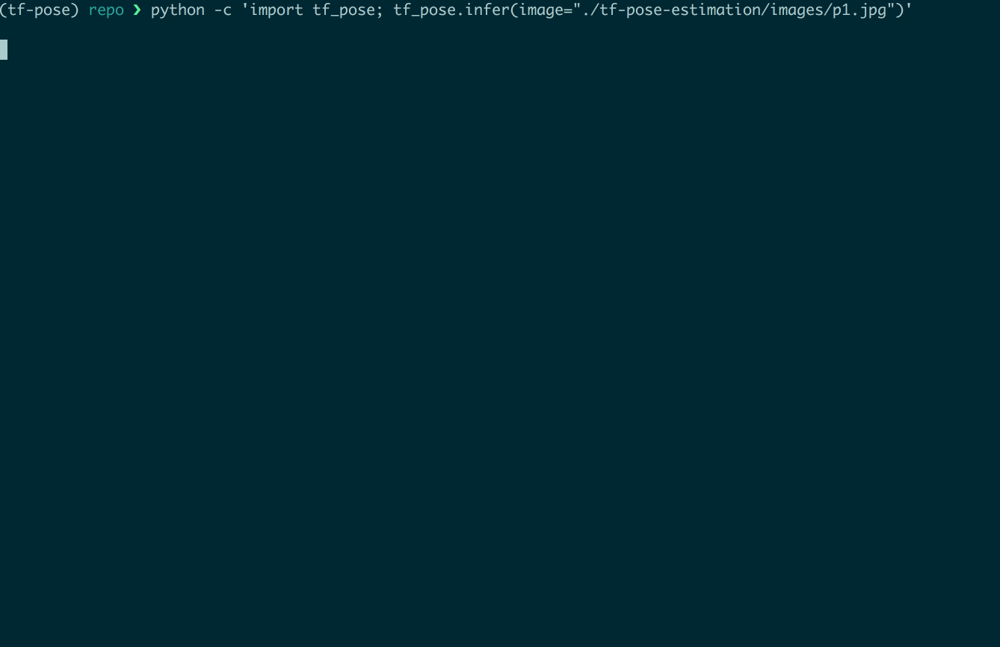

# 2d-pose-estimation

'Openpose' for human pose estimation have been implemented using Tensorflow. It also provides several variants that have made some changes to the network structure for **real-time processing on the CPU or low-power embedded devices.**

You need dependencies below.

- python3
- tensorflow 1.4.1+
- opencv3, protobuf, python3-tk

Clone the repo and install 3rd-party libraries.

```bash
$ git clone https://github.com/AaradhyaSaxena/05-computer-vision/tree/master/000_2D_pose_estimation
$ cd 000_2D_pose_estimation
$ pip3 install -r requirements.txt
```

Build c++ library for post processing. See : https://github.com/AaradhyaSaxena/05-computer-vision/tree/master/000_2D_pose_estimation/tf_pose/pafprocess
```
$ cd tf_pose/pafprocess
$ swig -python -c++ pafprocess.i && python3 setup.py build_ext --inplace
```
### Package Install

Alternatively, you can install this repo as a shared package using pip.

```bash
$ git clone https://github.com/AaradhyaSaxena/05-computer-vision/tree/master/000_2D_pose_estimation
$ cd 000_2D_pose_estimation
$ python setup.py install
```

#### Test installed package

```bash
python -c 'import tf_pose; tf_pose.infer(image="./images/p1.jpg")'
```


## Model 
- mobilenet

## Demo

### Test Inference

You can test the inference feature with a single image.

```
$ python run.py --model=mobilenet_thin --resize=432x368 --image=./images/p1.jpg
```

The image flag MUST be relative to the src folder with no "~", i.e:
```
--image ../../Desktop
```

Then you will see the screen as below with pafmap, heatmap, result and etc.


### Realtime Webcam

```
$ python run_webcam.py --model=mobilenet_thin --resize=432x368 --camera=0
```
